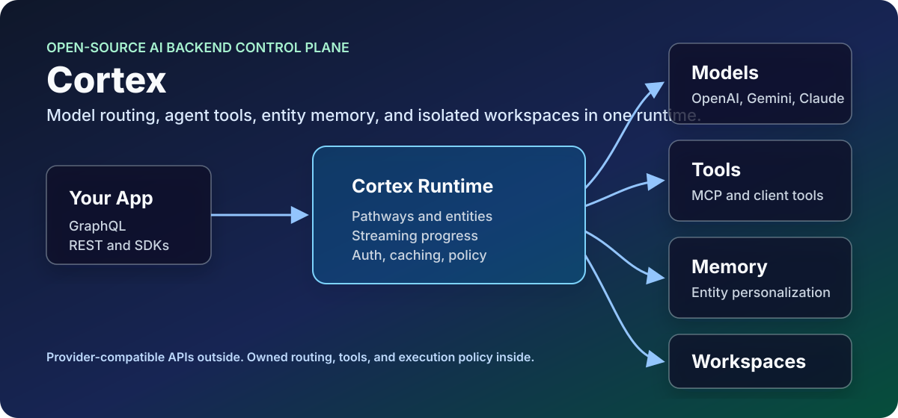

# Cortex

[](https://www.npmjs.com/package/@aj-archipelago/cortex)
[](LICENSE)
[](package.json)

Cortex is an open-source AI backend control plane: model routing, agent tools, OpenAI-compatible APIs, and private workspaces behind one programmable runtime.

It is built for teams that want the modern AI stack without welding their product to one provider SDK, one brittle prompt chain, or one proprietary agent loop.



## What You Get

- **One API for many providers.** Route OpenAI, Azure OpenAI, Gemini, Claude on Vertex, Grok, Replicate-hosted media models, Ollama, local models, and custom provider plugins through GraphQL, REST, OpenAI-compatible chat/completions/responses, and Anthropic-style messages APIs.
- **Routing that can adapt.** Use model groups, redirects, per-request model overrides, endpoint health, duplicate-request hedging, and background latency sampling so "the default model" can be a strategy instead of a hardcoded string.
- **An agent harness you can own.** `sys_entity_agent` combines entity configuration, tools, MCP discovery, client-side tools, request-scoped tools, streaming progress, tool-result compaction, and memory-aware context into one reusable agent pathway.
- **Private workspaces for real work.** Attach each entity to an isolated Docker or Azure Container Instances workspace with shell access, file APIs, checkpoint/restore, warm-pool provisioning, and secret injection.
- **Simple extension points.** Add a capability with one pathway file, then graduate to `executePathway` when you need validation, orchestration, custom tools, provider-specific handling, or richer result metadata.

## Why Cortex Exists

The frontier AI product pattern is getting clearer: multi-model routing, agentic tool loops, entity personalization, memory, MCP-style tool discovery, client-side tool callbacks, and dedicated agent workspaces. Big products and funded startups are converging on those pieces because serious AI apps need more than a chat wrapper.

Cortex puts those pieces in one open backend that you can run, inspect, customize, and embed.

Model APIs keep changing. Capabilities move between providers. Latency shifts by region and hour. Agent tool catalogs grow until the model drowns in schemas. Workspace execution needs isolation, persistence, and recoverability. Product teams still need one stable API.

Cortex turns that mess into infrastructure:

- A model catalog with provider-specific execution plugins.
- A model router that can redirect old model ids, expose model aliases, and pick healthy group members using latency samples.
- A GraphQL schema generated from pathways, entities, and dynamic configuration.
- Optional REST surfaces for generic pathways and provider-compatible clients.
- An agent harness that can discover tools only when needed, execute them, stream progress, compact results, and continue the reasoning loop.
- A workspace layer that can provision private sandboxes locally or in Azure and restore durable state after idle reaping.

## Why Cortex Instead Of...

| Alternative                 | Good at                                    | Where Cortex is different                                                                                     |
| --------------------------- | ------------------------------------------ | ------------------------------------------------------------------------------------------------------------- |
| Provider SDKs               | Direct access to one provider's newest API | Cortex keeps product code behind a stable runtime while providers, models, and protocols change.              |
| Model proxies               | Unifying model calls and keys              | Cortex also has pathways, entities, tools, streaming progress, memory-aware agents, and workspaces.           |
| Prompt-chain frameworks     | Fast experimentation inside an app         | Cortex is a backend service with GraphQL, REST, auth, routing, cancellation, caching, and operational policy. |
| Proprietary agent platforms | Polished hosted loops                      | Cortex gives you the loop, tool surface, and workspace architecture in code you can own.                      |

## Start Here In 5 Minutes

If you are new to Cortex, pick the lane closest to what you are building:

| If you want to...                                   | Start with...                                                           | Why                                                                                                         |
| --------------------------------------------------- | ----------------------------------------------------------------------- | ----------------------------------------------------------------------------------------------------------- |
| Put one stable API in front of many model providers | [Model Configuration](#model-configuration) and [REST](#rest)           | Define models once, expose GraphQL or OpenAI-compatible REST, and move callers with redirects/groups later. |
| Build an agent with tools                           | [Agents And Entities](#agents-and-entities), then [Pathways](#pathways) | Entities define identity and tool access; pathways define the callable skills behind that agent.            |
| Give agents private compute                         | [Workspace Architecture](#workspace-architecture)                       | Workspaces give each entity a container for shell commands, files, checkpoints, and long-running work.      |
| Add a new capability                                | [Pathways](#pathways)                                                   | Most Cortex extensions are one pathway file plus, optionally, `executePathway` for orchestration.           |

The shortest path is:

1. Run Cortex locally.
2. Call a built-in pathway through GraphQL.
3. Enable OpenAI-compatible REST and call a model or agent.
4. Add one custom pathway.
5. Turn on entities, tools, and workspaces when your product needs them.

You do not need to understand every provider plugin or workspace knob before Cortex is useful.

## Try It

```sh
git clone git@github.com:aj-archipelago/cortex.git
cd cortex
npm install
CORTEX_ENABLE_REST=true npm start
```

Set `OPENAI_API_KEY` in your shell, `.env`, or `.env.local` before starting. Cortex loads `.env` and `.env.local` automatically for local runs; explicit shell variables win.

By default Cortex starts GraphQL at `http://localhost:4000/graphql`. From another terminal:

```sh
curl http://localhost:4000/healthcheck
```

Then call a pathway through Cortex's generated REST API:

```sh
curl http://localhost:4000/rest/summary \
  -H 'content-type: application/json' \
  -d '{
    "text": "Cortex routes model requests, runs pathways, and powers agentic tools."
  }'
```

Or call the same pathway through Cortex's generated GraphQL schema:

```sh
curl http://localhost:4000/graphql \
  -H 'content-type: application/json' \
  -d '{
    "query": "query($text: String!) { summary(text: $text) { result } }",
    "variables": {
      "text": "Cortex routes model requests, runs pathways, and powers agentic tools."
    }
  }'
```

## What Cortex Is Not

Cortex is not a UI framework, a prompt collection, or a thin SDK wrapper. It is the backend layer you put between AI-facing product code and the parts that keep changing: providers, model ids, tool schemas, streaming formats, workspace execution, and operational policy.

That means Cortex is best when you want:

- one internal AI API instead of provider SDKs scattered through your app,
- model upgrades without client rewrites,
- agents that can discover and use real tools,
- private compute for agent work,
- enough structure to operate this in production.

## Core Concepts

### 1. Open Model Router

Cortex model configs describe the provider, endpoint, credentials, request shape, metadata, REST emulation name, and media controls for each model. The router then handles:

- Provider plugins for OpenAI, OpenAI Responses, Azure OpenAI, Gemini, Claude/Anthropic, Grok/xAI, Replicate, VEO, Ollama, local models, embeddings, transcription, TTS, music, image, and video models.
- `modelRedirects` for moving callers off old ids without touching every client.
- `modelGroups` for aliases such as "default coding model" or "agent chat model" whose members can be selected dynamically.
- Background latency sampling for model-group members that have not seen recent comparable traffic.
- Endpoint health and fastest-endpoint selection inside each model.
- Request-level model override through pathway args.
- OpenAI-compatible REST exposure through `emulateOpenAIChatModel` and `emulateOpenAICompletionModel`.

The point is simple: product code should ask for the capability it wants. Cortex decides where that request should land.

### 2. Entity Agent Harness

`sys_entity_agent` is the main agentic runtime. It is a pathway, but it behaves like an agent harness:

- Loads an entity configuration by id or default entity.
- Resolves entity tools from global system tools plus entity-specific custom tools.
- Supports lazy tool discovery through `SearchAvailableTools` so the model does not need every schema upfront.
- Discovers MCP tools and can hot-load matched tools into the live request.
- Accepts caller-provided client-side tools and waits for client results.
- Supports request-scoped tools such as reauthentication and tool-result inspection.
- Runs the tool loop, sends structured progress events, enforces tool budgets, detects duplicate calls, compacts large results, and re-enters the model after each tool batch.
- Accepts pending user-message injection during long running streams.
- Can work through GraphQL or through the OpenAI-compatible `/v1/chat/completions` surface as `model: "cortex-agent"` when REST endpoints are enabled.

Entities are where you define personality, instructions, tool access, memory behavior, workspace behavior, and required environment. The harness is where that configuration becomes an actual runtime.

### 3. Private Containerized Workspaces

Cortex workspaces are isolated execution environments owned by entities. They are designed for agentic coding, research, file processing, data work, and other tasks where the agent should compute instead of bluffing.

The workspace stack includes:

- `WorkspaceSSH`, a consolidated shell tool with foreground commands, background jobs, polling, reset, restore, and destroy flows.
- `helper-apps/cortex-workspace`, a lightweight HTTP helper running inside the sandbox.
- Docker backend for local development.
- Azure Container Instances backend for hosted private workspaces.
- Warm pool support for faster first command latency.
- Per-workspace secret headers and secret rotation when warm containers are claimed.
- File upload, download, read, write, edit, browse, shell, status, backup, restore, and reset endpoints.
- Blob-backed checkpoint and restore for ACI workspaces.
- Optional encrypted checkpoints with ownership metadata validation.
- Idle checkpointing and idle reaping so sleeping workspaces stop burning compute while preserving useful state.

This follows the same pattern that has emerged in OpenClaw/NanoClaw-style systems: each agent gets a private, containerized machine room, not a shared scratchpad pretending to be isolation.

## Install As A Package

```sh
npm install @aj-archipelago/cortex
```

```js
import cortex from '@aj-archipelago/cortex';

const { startServer } = await cortex({
  PORT: 4000,
  defaultModelName: 'oai-gpt54-mini',
});

await startServer();
```

## API Surfaces

### GraphQL

Every enabled pathway becomes a GraphQL field. In development, the embedded Apollo landing page is available at `/graphql`.

Example:

```graphql
query Translate($text: String!, $to: String!) {
  translate(text: $text, to: $to) {
    result
  }
}
```

Agent example:

```graphql
query Agent($text: String!, $entityId: String) {
  sys_entity_agent(text: $text, entityId: $entityId, stream: false) {
    result
    resultData
  }
}
```

GraphQL also exposes:

- `requestProgress` subscriptions for streaming/progress events.
- `cancelRequest` mutation for cancellation.
- `submitClientToolResult` mutation for client-side tool callbacks.
- `injectAgentMessage` mutation for long-running agent loops.
- `executeWorkspace` query for controlled workspace execution.

### REST

REST is off by default. Enable it with:

```sh
export CORTEX_ENABLE_REST=true
```

When enabled, Cortex registers:

- `POST /rest/{pathwayName}` for non-emulation pathways.
- `POST /v1/chat/completions` for OpenAI-compatible chat models.
- `POST /v1/completions` for OpenAI-compatible completion models.
- `POST /v1/responses` for OpenAI Responses-style clients.
- `POST /v1/messages` for Anthropic-style clients.
- `GET /v1/models` for exposed REST models.

OpenAI-compatible agent call:

```sh
curl http://localhost:4000/v1/chat/completions \
  -H 'content-type: application/json' \
  -d '{
    "model": "cortex-agent",
    "messages": [
      { "role": "user", "content": "Create a short launch checklist for Cortex." }
    ],
    "stream": true
  }'
```

OpenAI-compatible model call:

```sh
curl http://localhost:4000/v1/responses \
  -H 'content-type: application/json' \
  -d '{
    "model": "gpt-5.4-mini",
    "input": "Explain model groups in one paragraph."
  }'
```

If `CORTEX_API_KEY` is set, Cortex accepts the key through `cortex-api-key`, `Authorization: Bearer ...`, or `x-api-key`.

## Model Configuration

Model configuration lives in `config/default.example.json` and can be overridden through `CORTEX_CONFIG_FILE`, direct config passed to the package, or environment variables.

Minimal custom model shape:

```json
{
  "models": {
    "my-openai-model": {
      "name": "my-openai-model",
      "type": "OPENAI-RESPONSES",
      "supportsStreaming": true,
      "emulateOpenAIChatModel": "my-model",
      "endpoints": [
        {
          "name": "openai",
          "url": "https://api.openai.com/v1/responses",
          "headers": {
            "Authorization": "Bearer {{OPENAI_API_KEY}}"
          },
          "params": {
            "model": "gpt-5.4-mini"
          }
        }
      ],
      "metadata": {
        "displayName": "My Model",
        "provider": "openai",
        "category": "chat"
      }
    }
  }
}
```

### Model Redirects

Use redirects to move clients forward without breaking old callers:

```json
{
  "modelRedirects": {
    "old-default": "oai-gpt54-mini",
    "gpt-4o": "oai-gpt54-mini"
  }
}
```

Redirects resolve before endpoint lookup and before model-group selection.

### Model Groups

Use model groups when a "model" should really be a ranked capability pool:

```json
{
  "modelGroups": {
    "cortex-agent-chat": {
      "members": [
        "oai-gpt54-mini",
        "gemini-flash-35-vision",
        "claude-46-sonnet-vertex"
      ],
      "metadata": {
        "displayName": "Fast Agent Chat",
        "provider": "cortex",
        "category": "chat",
        "isAgentic": true
      }
    }
  }
}
```

The picker uses sampler-owned ping TTFB so group members are compared against the same kind of request. Members within the slowness tolerance of the fastest sample are selected by priority order. If no usable latency data exists yet, Cortex falls back to the first configured member.

## Current Built-In Model Families

The open-source catalog is intentionally current-leaning. It includes modern chat, reasoning, vision, image, video, music, speech, embeddings, transcription, and hosted media models across:

- OpenAI Responses and image/audio models.
- Azure OpenAI deployments.
- Gemini 3.x chat, reasoning, image, TTS, and music models.
- Claude 4.x on Vertex.
- Grok/xAI chat, reasoning, responses, and code models.
- VEO 3.1 video variants.
- Replicate-hosted image, video, and speech models.
- Ollama and local model adapters.

Clients can inspect publishable model metadata through `sys_model_metadata`, including display names, provider, category, group status, media controls, required environment, and pricing aliases where configured.

## Agents And Entities

An entity is a configured agent identity. It can define:

- `name`
- `description`
- `instructions`
- `tools`
- `customTools`
- `useMemory`
- `workspace`
- `requiredEnvVars`

Minimal entity:

```js
import cortex from '@aj-archipelago/cortex';

const { startServer } = await cortex({
  entityConfig: {
    engineer: {
      name: 'Engineer',
      description: 'A practical software agent with workspace access.',
      instructions: 'Be direct, verify with tools, and prefer working code.',
      tools: ['workspacessh', 'SearchAvailableTools'],
      useMemory: true,
    },
  },
});

await startServer();
```

Tool registration is pathway-based. A pathway with a valid `toolDefinition` can become an entity tool. Custom tools can also be supplied in entity config, and callers can pass `clientSideTools` for UI/browser/native actions that execute outside Cortex and return through `submitClientToolResult`.

MCP servers can be provided per request through `mcpConfig` and `mcpAvailableServers`. Cortex discovers those tools into a catalog, exposes search/rehydration tools, and avoids dumping every MCP schema into the first model call.

## Workspace Architecture

Workspace behavior is controlled by the shared workspace client and `cortex-workspace` helper.

Important configuration:

```sh
export WORKSPACE_BACKEND=docker
export WORKSPACE_IMAGE=cortex-workspace
export WORKSPACE_IMAGE_VERSION=1.0.12
export WORKSPACE_CPUS=2
export WORKSPACE_MEMORY=4g
export WORKSPACE_IDLE_TIMEOUT_MS=1800000
export WORKSPACE_IDLE_CHECKPOINT_MS=900000
```

For Azure Container Instances:

```sh
export WORKSPACE_BACKEND=aci
export AZURE_RESOURCE_GROUP=<resource-group>
export AZURE_LOCATION=<region>
export AZURE_SUBSCRIPTION_ID=<subscription-id>
export AZURE_BLOB_CONTAINER_NAME=<container>
export WORKSPACE_CONTAINER_PREFIX=workspace
export WARM_POOL_ENABLED=true
export WARM_POOL_SIZE=2
```

The helper inside the container exposes authenticated endpoints for:

- `/health`
- `/shell`
- `/shell/result/:processId`
- `/shell/jobs`
- `/read`
- `/write`
- `/edit`
- `/browse`
- `/status`
- `/backup`
- `/restore`
- `/restore-url`
- `/upload-url`
- `/backup-upload-url`
- `/reset`
- `/download`
- `/upload`
- `/reconfigure`

The workspace client uses `x-workspace-secret` on helper calls. ACI workspaces can checkpoint to Blob Storage, restore into fresh or warm containers, and be destroyed after idle timeout. Docker workspaces can stop and restart while preserving local container state.

## Pathways

Pathways are the lower-level Cortex primitive: a JavaScript module that becomes an API endpoint. A pathway can be a single prompt, a multi-step prompt chain, a custom execution function, a tool, a REST-emulated model surface, or a full agent harness.

Pathways are loaded from the core `pathways` directory and from `CORTEX_PATHWAYS_PATH`. Custom pathways override core pathways with the same name.

### Minimal Pathway

A pathway can be only a prompt:

```js
export default {
  prompt: '{{text}}\n\nRewrite the above in a sharper, clearer style:',
};
```

With that file in `pathways/rewrite.js`, Cortex generates a GraphQL query named `rewrite`. It uses the default pathway settings from `pathways/basePathway.js`, including:

- `text`, `async`, `contextId`, and `stream` default parameters.
- Generated GraphQL type definitions.
- The standard root resolver and pathway resolver.
- Input chunking enabled by default.
- The configured default model unless the pathway or request overrides it.

### Input Parameters

Add `inputParameters` to expose arguments in GraphQL and REST conversion:

```js
export default {
  prompt: 'Translate this from {{from}} to {{to}}:\n\n{{{text}}}',
  inputParameters: {
    from: 'auto',
    to: 'en',
    preserveFormatting: true,
    maxAlternatives: { type: 'integer', default: 1 },
    tags: { type: 'array', items: { type: 'string' }, default: [] },
  },
};
```

Simple JavaScript values infer GraphQL types. JSON Schema-style objects give you explicit types and defaults. Complex objects fall back to JSON strings unless a specific GraphQL input object is supported.

### Prompt Forms

`prompt` can be a string, an array of strings, a `Prompt` object, or an array of `Prompt` objects.

Sequential prompt chain:

```js
export default {
  prompt: [
    '{{{text}}}\n\nExtract the named entities:',
    'Entities:\n{{{previousResult}}}\n\nRewrite the text preserving those names:\n{{{text}}}',
  ],
};
```

Chat-style prompt:

```js
import { Prompt } from '../server/prompt.js';

export default {
  prompt: [
    new Prompt({
      messages: [
        { role: 'system', content: 'You are a careful technical editor.' },
        { role: 'user', content: '{{{text}}}' },
      ],
    }),
  ],
};
```

In a prompt sequence, `previousResult` contains the prior step output and can be used in later prompts. Cortex handles model execution, chunking, parsing, warnings/errors, debug output, saved context, and streaming through the standard pathway lifecycle.

### Models

Choose a model at the pathway level when the endpoint has a natural default:

```js
export default {
  model: 'oai-gpt54-mini',
  prompt: '{{{text}}}\n\nSummarize this in {{sentences}} sentences.',
  inputParameters: {
    sentences: 3,
  },
};
```

The normal precedence is:

1. `pathway.model`
2. request args such as `model` or `modelOverride`, depending on the execution path
3. `pathway.inputParameters.model`
4. `defaultModelName`

Model redirects and model groups are resolved by the request executor before the provider call.

### `executePathway`: The Advanced Default

Use `executePathway` when a pathway needs code but should still keep the standard Cortex lifecycle. This is the preferred advanced extension point.

Signature:

```js
executePathway: async ({ args, runAllPrompts, resolver }) => {
  // return a string, object/stringified JSON, or provider response
}
```

The arguments are:

- `args`: request arguments. GraphQL applies generated defaults for public queries; direct internal calls should merge `resolver.pathway.inputParameters` when they need pathway defaults.
- `runAllPrompts`: the standard prompt execution function, already bound to the current `PathwayResolver`.
- `resolver`: the active `PathwayResolver`; use it for warnings, errors, `pathwayPrompt`, `pathwayResultData`, request ids, tool metadata, or calling other pathways with shared context.

Simple deterministic pathway:

```js
export default {
  inputParameters: {
    text: '',
  },
  executePathway: async ({ args }) => {
    return args.text.trim().toUpperCase();
  },
};
```

Preprocess, then use normal model execution:

```js
export default {
  model: 'oai-gpt54-mini',
  prompt: 'Create a concise release note from this normalized diff:\n\n{{{normalizedDiff}}}',
  inputParameters: {
    diff: '',
  },
  useInputChunking: false,
  executePathway: async ({ args, runAllPrompts }) => {
    const normalizedDiff = args.diff
      .split('\n')
      .filter(line => !line.startsWith('package-lock.json'))
      .join('\n');

    return await runAllPrompts({
      ...args,
      normalizedDiff,
    });
  },
};
```

Compose other pathways:

```js
import { callPathway } from '../lib/pathwayTools.js';

export default {
  model: 'oai-gpt54-mini',
  prompt: 'Using this summary, extract the concrete action items:\n\n{{{summary}}}',
  inputParameters: {
    text: '',
  },
  executePathway: async ({ args, runAllPrompts, resolver }) => {
    const summary = await callPathway('summary', {
      text: args.text,
      model: args.model,
    }, resolver);

    return await runAllPrompts({
      ...args,
      summary,
    });
  },
};
```

Build the prompt dynamically:

```js
import { Prompt } from '../server/prompt.js';

export default {
  inputParameters: {
    text: '',
    tone: 'direct',
  },
  executePathway: async ({ args, runAllPrompts, resolver }) => {
    resolver.pathwayPrompt = [
      new Prompt({
        messages: [
          { role: 'system', content: `Write in a ${args.tone} tone.` },
          { role: 'user', content: '{{{text}}}' },
        ],
      }),
    ];

    return await runAllPrompts(args);
  },
};
```

Use `executePathway` for validation, preprocessing, postprocessing, pathway composition, dynamic prompts, provider-specific normalization, result metadata, and orchestration. It keeps timeout handling, logging, generated GraphQL shape, streaming behavior, cancellation state, model routing, warnings/errors, and result packaging in the normal Cortex path.

### Result Data, Warnings, And Errors

The standard GraphQL response envelope includes:

- `result`
- `resultData`
- `warnings`
- `errors`
- `debug`
- `previousResult`
- `contextId`
- `tool`

Inside `executePathway`, populate extra structured metadata on the resolver:

```js
export default {
  inputParameters: {
    text: '',
  },
  executePathway: async ({ args, resolver }) => {
    const words = args.text.trim().split(/\s+/).filter(Boolean);

    resolver.pathwayResultData = {
      wordCount: words.length,
    };

    if (words.length === 0) {
      resolver.warnings.push('Input text was empty.');
    }

    return words.join(' ');
  },
};
```

### Tools

A pathway becomes an entity tool when it has a valid `toolDefinition`:

```js
export default {
  prompt: 'Rewrite this in {{style}} style:\n\n{{{text}}}',
  inputParameters: {
    text: '',
    style: 'plain',
  },
  toolDefinition: [{
    type: 'function',
    function: {
      name: 'RewriteText',
      description: 'Rewrite text in a requested style.',
      parameters: {
        type: 'object',
        properties: {
          text: { type: 'string', description: 'The text to rewrite.' },
          style: { type: 'string', description: 'The target writing style.' },
        },
        required: ['text'],
      },
    },
  }],
};
```

During startup, Cortex registers pathway tools into `entityTools`. `sys_entity_agent` can then expose them according to each entity's `tools` configuration, lazy tool search, and request-scoped tool rules.

### REST Exposure

With `CORTEX_ENABLE_REST=true`, non-emulation pathways are available at:

```text
POST /rest/{pathwayName}
```

Models and agent-like pathways can also expose provider-compatible REST surfaces:

```js
import { Prompt } from '../server/prompt.js';

export default {
  emulateOpenAIChatModel: 'my-chat-model',
  useInputChunking: false,
  prompt: [
    new Prompt({ messages: ['{{messages}}'] }),
  ],
  inputParameters: {
    messages: [{ role: '', content: [] }],
  },
};
```

That pathway can be called through `/v1/chat/completions` with `model: "my-chat-model"`.

### Overriding `resolver`

Overriding `resolver` is still supported, but it is the deep escape hatch. Use it when you truly need to control the Apollo resolver layer or bypass the normal `PathwayResolver.resolve(args)` flow.

```js
export default {
  inputParameters: {
    topic: '',
  },
  resolver: async (_parent, args, contextValue, _info) => {
    const { pathwayResolver } = contextValue;
    pathwayResolver.pathwayResultData = { source: 'custom-resolver' };
    return `Handled directly: ${args.topic}`;
  },
};
```

Reach for a custom `resolver` only when you need one of these:

- A custom GraphQL behavior that does not fit generated pathway execution.
- Direct access to Apollo `parent`, `contextValue`, or `info`.
- A highly specialized read/query endpoint that should not run model execution.
- Compatibility with older pathways that already own their resolver flow.

For most advanced work, use `executePathway`. It is easier to read, easier to test, and keeps you inside the Cortex request lifecycle instead of reimplementing it.

### Avoid Overriding `rootResolver`

`rootResolver` owns the outer response envelope, timeout wrapper, request logging behavior, `PathwayResolver` creation, GraphQL cache hints, error coercion, and final response packaging. Override it only if you are intentionally replacing the public GraphQL execution contract for that pathway.

### Pathway Property Reference

This section is intentionally exhaustive. Most pathways only need `prompt`, `inputParameters`, `model`, and sometimes `executePathway`.

<details>
<summary>Complete pathway property reference</summary>

Every pathway is merged with `pathways/basePathway.js` at startup. File-defined pathways, config overrides, and generated REST pathways all end up as the same kind of pathway object.

Core identity and API shape:

| Property | Type | Default | What it does |
| --- | --- | --- | --- |
| `name` | `string` | file key | Runtime pathway name. Cortex sets this during load. Usually do not set it manually unless generating pathways. |
| `objName` | `string` | capitalized file key | GraphQL response type name. Cortex sets this during load. |
| `disabled` | `boolean` | `false` | Skips the pathway when building GraphQL and REST routes. Useful for config-level opt out. |
| `isMutation` | `boolean` | `false` | Registers the pathway under GraphQL `Mutation` instead of `Query`. Mutation arguments do not get generated default values. |
| `format` | `string` | unset | Defines fields for structured list results. With `list: true`, numbered object output can be parsed into objects with these field names. |
| `list` | `boolean` | `false` | Makes the generated `result` type a list and enables list parsing for numbered or comma-separated model output. |
| `typeDef` | `function` | built in | Builds GraphQL type definitions and REST parameter metadata. Override only for custom GraphQL shape. |
| `rootResolver` | `function` | built in | Outer GraphQL resolver that creates `PathwayResolver` and wraps the response envelope. Avoid overriding except for deep framework work. |
| `resolver` | `function` | built in | Inner resolver called by `rootResolver`. Override only when `executePathway` is not enough. |

Prompt and execution:

| Property | Type | Default | What it does |
| --- | --- | --- | --- |
| `prompt` | `string \| array \| Prompt` | `'{{text}}'` | The prompt or prompt sequence. Strings are Handlebars templates. Arrays run as sequences unless an `executePathway` changes execution. |
| `executePathway` | `function` | unset | Preferred advanced hook. Receives `{ args, runAllPrompts, resolver }` and can preprocess, orchestrate, call other pathways, set dynamic prompts, or return directly. |
| `model` | `string` | default model | Preferred model id or model-group alias for this pathway. Redirects and groups resolve before provider execution. |
| `temperature` | `number` | `0.9` | Passed into model plugins that support it. Also enables request caching when `temperature == 0` and global cache is on. |
| `json` | `boolean` | `false` | Tells the response parser to parse/repair JSON output before returning. |
| `parser` | `function` | unset | Custom output parser. Runs before built-in `list` or `json` parsing. |
| `timeout` | `number` | `120` | Pathway timeout in seconds. Also influences provider request timeout and duplicate-request expiration. |
| `requestLoggingDisabled` | `boolean` | `false` | Suppresses non-error request logging while this pathway runs. |

Inputs and generated parameters:

| Property | Type | Default | What it does |
| --- | --- | --- | --- |
| `defaultInputParameters` | `object` | `{ text, async, contextId, stream }` | Baseline parameters present on every standard pathway. Override cautiously; most pathways should add to `inputParameters` instead. |
| `inputParameters` | `object` | `{}` | Public arguments for GraphQL and REST conversion. Values can be defaults or JSON Schema-style type specs. |
| `inputParameters.text` | `string` | `''` | Main text input. Prompts that include `{{text}}` participate in chunking. |
| `inputParameters.async` | `boolean` | `false` | Enables async progress publishing for multi-step/chunked work. |
| `inputParameters.contextId` | `string` | `''` | Saved context key. If omitted, Cortex creates one. |
| `inputParameters.contextKey` | `string` | unset | Optional encryption/context namespace key used by memory/context helpers. |
| `inputParameters.stream` | `boolean` | `false` | Requests streaming when the selected model/plugin supports it. Multi-chunk requests are converted to async progress behavior. |
| `inputParameters.model` | `string` | unset | Common pattern for per-request model selection, especially in custom pathways and REST-emulated pathways. |
| `modelOverride` | request arg | unset | Runtime model swap handled by `PathwayResolver.promptAndParse()`. Use when the pathway should be able to swap models after resolver construction. |

Chunking and context management:

| Property | Type | Default | What it does |
| --- | --- | --- | --- |
| `useInputChunking` | `boolean` | `true` | Splits long `text` into semantic chunks sized to the selected model and prompt. Set `false` for chat, agent, media, embeddings, or provider-native payloads. |
| `inputChunkSize` | `number` | computed | Explicit chunk token size. If unset, Cortex calculates it from model context and prompt size. |
| `inputFormat` | `'text' \| 'html'` | `'text'` | Hint for semantic chunking. HTML mode preserves document structure better for HTML-like input. |
| `useParallelChunkProcessing` | `boolean` | `false` | Runs full prompt sequences against chunks in parallel. Faster, but `previousResult` is per chunk and not globally accumulated. |
| `joinChunksWith` | `string` | `'\n\n'` | Separator used when joining multi-chunk results. |
| `useInputSummarization` | `boolean` | `false` | Summarizes input through the `summary` pathway before normal processing. |
| `truncateFromFront` | `boolean` | `false` | Makes token truncation keep the beginning of long input instead of the end. Available to plugins through prompt parameters. |
| `manageTokenLength` | `boolean` | `true` | Plugin-level hint to manage/truncate oversized prompts for model calls that support this behavior. Agentic pathways often set this false. |

Caching, duplicate requests, and GraphQL cache:

| Property | Type | Default | What it does |
| --- | --- | --- | --- |
| `enableCache` | `boolean` | unset | Enables provider-response cache for this pathway when global `CORTEX_ENABLE_CACHE` is true. Temperature `0` also enables caching. |
| `enableGraphqlCache` | `boolean` | unset | Enables Apollo response cache hints when the pathway temperature is `0` and GraphQL cache is configured. |
| `enableDuplicateRequests` | `boolean` | `false` | Allows hedged duplicate provider requests for latency spikes. If unset, the global config can still enable duplicates. |
| `duplicateRequestAfter` | `number` | `10` | Seconds before Cortex sends a duplicate provider request when duplicate requests are enabled. |

Tools and agent integration:

| Property | Type | Default | What it does |
| --- | --- | --- | --- |
| `toolDefinition` | `object \| array` | `{}` | OpenAI-style function tool schema. Valid tools are registered into `entityTools` at startup. |
| `toolCallback` | `function` | unset | Handles model tool calls for pathways that stream tool-capable model responses, especially `sys_entity_agent`. |
| `tools` | provider-specific | unset | Tool schemas passed through to some model plugins. For most entity tools, prefer `toolDefinition` plus entity config. |

REST emulation:

| Property | Type | Default | What it does |
| --- | --- | --- | --- |
| `emulateOpenAIChatModel` | `string` | unset | Exposes this pathway through `/v1/chat/completions` under the given model id when REST is enabled. |
| `emulateOpenAICompletionModel` | `string` | unset | Exposes this pathway through `/v1/completions` under the given model id when REST is enabled. |
| `restStreaming` | `object` | unset | Model-config helper used by generated REST streaming pathways. Can add input parameters, safety settings, timeout, or duplicate-request behavior. |

Provider and plugin-specific pathway parameters:

| Property | Common users | What it does |
| --- | --- | --- |
| `maxTokenLength`, `maxReturnTokens`, `max_tokens` | OpenAI, Kimi, generic plugins | Token limits or provider request max-token parameters. |
| `responseFormat` | OpenAI/Kimi reasoning and vision plugins | Sets provider response format where supported. |
| `reasoningEffort` | OpenAI reasoning, Grok, Gemini reasoning | Default reasoning effort when the request does not provide one. |
| `thinkingLevel`, `thinking_level`, `includeThoughts`, `include_thoughts` | Gemini reasoning | Controls provider-specific thinking/reasoning behavior. |
| `systemPrompt` | workspace/agent helper pathways | Default system prompt or system instruction source for custom execution paths. |
| `response_modalities` | multimodal providers | Provider-specific response modality controls. |
| `aspectRatio`, `aspect_ratio`, `image_size` | image/video providers | Default media generation controls. |
| `fileHashes` | dynamic/user pathways | File references resolved by the dynamic pathway runner before execution. |
| Any other pathway key | model plugins and templates | Cortex copies pathway keys into plugin prompt parameters, so provider plugins and Handlebars prompts can read pathway-level defaults without extra plumbing. |

Prompt object properties:

| Property | Type | What it does |
| --- | --- | --- |
| `prompt` | `string` | Single Handlebars text prompt. |
| `messages` | `array` | Chat-style messages. Message content can contain Handlebars templates. |
| `context` | provider-specific | Extra prompt context used by plugins that support it. |
| `examples` | provider-specific | Few-shot examples used by plugins that support them. |
| `name` | `string` | Prompt name, used by dynamic pathway tooling and diagnostics. |
| `saveResultTo` | `string` | Saves a prompt result into `savedContext[saveResultTo]`; memory section names also update the matching resolver memory field. |

Property rules of thumb:

- Start with `prompt`, `inputParameters`, and `model`.
- Use `executePathway` for almost every advanced case.
- Set `useInputChunking: false` for chat history, media generation, embeddings, agent loops, and provider-native payloads.
- Use `json`, `list`, `format`, or `parser` when the caller needs structured output.
- Use `toolDefinition` to make a pathway callable by entities.
- Use `emulateOpenAIChatModel` only when the pathway should look like a model to OpenAI-compatible clients.
- Override `resolver`, `rootResolver`, or `typeDef` only when you are deliberately changing the framework-level GraphQL contract.

</details>

## Configuration

Cortex uses `convict` configuration. Values come from defaults, config files, direct package config, and environment variables.

Common environment variables:

| Variable | Purpose |
| --- | --- |
| `CORTEX_PORT` | HTTP port. Defaults to `4000`. |
| `CORTEX_API_KEY` | Comma-separated API keys for Cortex auth. |
| `CORTEX_CONFIG_FILE` | JSON config file to load. |
| `CORTEX_PATHWAYS_PATH` | Custom pathway directory. |
| `DEFAULT_MODEL_NAME` | Global default model id. |
| `MODEL_REDIRECTS` | JSON model redirect map. |
| `CORTEX_MODELS` | JSON model config override. |
| `CORTEX_ENABLE_REST` | Enable REST routes. |
| `CORTEX_ENABLE_CACHE` | Enable pathway cache. |
| `CORTEX_ENABLE_GRAPHQL_CACHE` | Enable Apollo response cache. |
| `CORTEX_ENABLE_DUPLICATE_REQUESTS` | Enable hedged duplicate requests. |
| `OPENAI_API_KEY` | OpenAI API key. |
| `CLAUDE_API_KEY` | Anthropic API key. |
| `GEMINI_API_KEY` | Gemini API key. |
| `GCP_SERVICE_ACCOUNT_KEY` | Vertex/GCP service account JSON. |
| `AZURE_SERVICE_PRINCIPAL_CREDENTIALS` | Azure service principal JSON. |
| `REPLICATE_API_KEY` | Replicate API key. |
| `XAI_API_KEY` | xAI/Grok API key, where configured. |
| `OLLAMA_URL` | Ollama base URL for local models. |
| `STORAGE_CONNECTION_STRING` | Redis/storage connection used by cache and related services. |
| `MONGO_URI` | Mongo-backed entity store, where used. |

See `config.js` for the full schema and `config/default.example.json` for the built-in model catalog.

## Streaming, Progress, And Cancellation

Cortex supports streaming at several layers:

- GraphQL subscriptions via `requestProgress`.
- OpenAI-compatible SSE for `/v1/chat/completions` and `/v1/responses`.
- Provider-native streaming where supported by plugins.
- Structured tool start/finish progress events from agent tools.
- Request cancellation through `cancelRequest`.

For agents, tool callbacks may continue after the first streaming model response. Cortex keeps the callback chain alive, avoids closing MCP clients prematurely, and drains pending user-message injections into the next loop.

## Caching And Throughput

Cortex includes:

- Optional pathway result caching.
- Optional GraphQL response caching.
- Model-specific token management and input chunking.
- Parallel chunk processing for suitable pathways.
- Rate limiting through per-endpoint limiters.
- Endpoint health monitoring and fastest-endpoint selection.
- Duplicate request hedging for latency spikes when enabled.

This lets simple endpoints stay simple while heavier workflows can still be tuned.

## Helper Apps

The repo includes helper apps used by larger Cortex deployments:

- `helper-apps/cortex-workspace`: sandbox helper for private entity workspaces.
- `helper-apps/cortex-file-handler`: file storage and processing service.
- `helper-apps/cortex-doc-to-pdf`: document conversion service and examples.
- `helper-apps/cortex-realtime-voice-server`: realtime voice support.
- `helper-apps/cortex-markitdown`: document-to-markdown helper.
- `helper-apps/mogrt-handler`: motion graphics template handling.

Some helper apps have their own README files and deployment assumptions.

## Development

Install dependencies:

```sh
npm install
```

Run Cortex:

```sh
npm start
```

Run the fast hermetic unit and script suite:

```sh
npm test
```

This is the default local and CI gate. It uses `config/default.example.json`
and a dummy `OPENAI_API_KEY`, and does not load `.env`.

Run live integration tests explicitly:

```sh
npm run test:integration
```

Integration tests load `.env`, enable REST routes for the test process, and
may require provider keys, Redis, MongoDB, workspace services, or other local
infrastructure. Some live REST compatibility groups are further gated by
`CORTEX_RUN_REST_LIVE_TESTS=true` or vendor-specific live-test flags. For the
REST integration subset only, use:

```sh
npm run test:integration:rest
```

To run both lanes:

```sh
npm run test:all
```

Focused helper tests may use their own package scripts, for example:

```sh
cd helper-apps/cortex-workspace
node --test tests/
```

The root test runner is AVA. The workspace helper uses Node's built-in test runner.

## Project Layout

```text
config.js                         configuration schema and startup build
config/default.example.json        built-in public model catalog
index.js                           package entry point
start.js                           CLI server start
lib/requestExecutor.js             provider routing, redirects, groups, endpoint selection
lib/modelSampler.js                background latency sampler for model groups
server/graphql.js                  Apollo/Express/GraphQL/WebSocket server
server/rest.js                     REST route registration
server/plugins/                    provider execution plugins
pathways/                          core pathways
pathways/system/entity/            entity agent harness and tools
pathways/system/sys_model_metadata.js model metadata publication pathway
helper-apps/cortex-workspace/      private workspace helper image
docs/                              focused contracts and notes
tests/                             AVA test suite
```

## Security Notes

Cortex is infrastructure. Treat it like infrastructure:

- Put it behind auth in any shared environment.
- Set `CORTEX_API_KEY` or front Cortex with your own gateway.
- Keep provider keys in environment/config secrets, not pathway source.
- Give entities the minimum tool set they need.
- Use workspace isolation for shell/file execution instead of running untrusted work in the Cortex process.
- Review custom pathways and tools before exposing them through REST.
- Be careful with MCP configs supplied by clients; Cortex redacts and validates sensitive MCP config paths, but your host application still owns trust decisions.

## License

Cortex is released under the MIT License. See [LICENSE](LICENSE).
