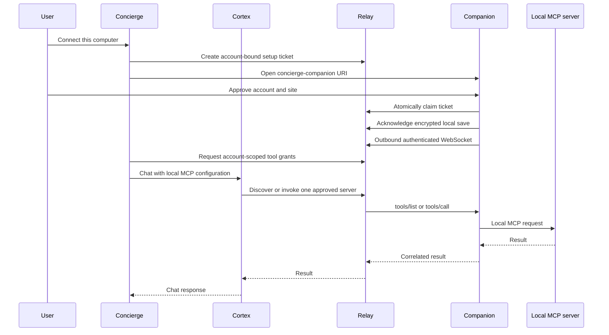

# Local computers in Concierge

This feature lets a signed-in Concierge user call MCP tools on a paired computer.
The companion makes an outbound TLS WebSocket connection. It does not expose a
local port to the internet or need a tunnel, firewall rule, or browser localhost
permission.



## Services and configuration

Deploy `helper-apps/cortex-companion-relay` as its own service with WebSocket
ingress and a TLS endpoint. Its Dockerfile runs as the non-root `node` user.

| Setting | Relay | Concierge | Cortex |
| --- | --- | --- | --- |
| `REDIS_URL` | Dedicated private Redis with authentication and TLS | | |
| `COMPANION_ADMIN_KEY` | Dedicated secret, at least 32 characters | Same secret; server only | |
| `COMPANION_NAMESPACE` | Unique Redis prefix for this environment | | |
| `CORTEX_COMPANION_RELAY_URL` | | HTTPS relay origin | Same origin |
| `COMPANION_OWNER_NAMESPACE` | | Stable identifier unique to this Concierge deployment | |
| `CONCIERGE_PUBLIC_URL` | | Public HTTPS origin for pairing CSRF checks behind proxies | |
| `COMPANION_DOWNLOAD_MAC` | | HTTPS URL of the signed Mac installer | |
| `COMPANION_DOWNLOAD_WINDOWS` | | HTTPS URL of the signed Windows installer | |
| `PORT` | Listener port, default 8080 | | |

The public `/api/companion/config` endpoint must be reachable by the native app
before sign-in. It exposes the relay origin and download URLs only. If an external
auth gateway protects every path, exempt this one discovery route; account APIs
remain authenticated. Do not expose any admin key in public settings or installers.

Redis is required. Device registrations persist until revoked, while pending
pairing codes expire after ten minutes, call grants after one hour, and presence
after 45 seconds without renewal. Use Redis persistence/backups and a non-evicting
policy for the device registry. Use separate namespaces and keys for dev and prod.
An unavailable Redis fails closed. Health checks include a Redis round trip.

Multiple replicas share ownership and presence through Redis. Pub/sub forwards a
request to the replica holding the socket and returns its result to the caller.
Load-balancer affinity is unnecessary. Configure a proxy idle timeout above the
15-second heartbeat and a request timeout above the two-minute tool deadline.
Use at least one continuously running relay replica; scale additional replicas on
active connections and memory, not HTTP request count alone. Restarts disconnect
sockets, which reconnect; in-flight calls fail without replay.

## Local development

Run an isolated Redis, set a newly generated admin key, and start the relay:

```sh
cd helper-apps/cortex-companion-relay
npm ci
npm start
```

Set both development applications' relay origin to `http://127.0.0.1:8080`,
configure the Concierge owner namespace and admin key, and start their usual dev
servers. Development Electron accepts a loopback HTTP Concierge address. Packaged
customer builds require HTTPS. In Concierge open `/local-computers` and select
**Connect this computer**. Packaged apps register `concierge-companion://connect` on
macOS and Windows. For an unpackaged development app, the manual pairing-code
flow remains under Advanced settings / Troubleshooting.

## Authorization and execution limits

- Pairing approval derives the owner from Concierge's authenticated database user ID
  plus a deployment namespace. Caller-supplied owner IDs are ignored.
- Setup tickets and fallback codes expire after ten minutes and are atomically
  single use. Tickets bind the authenticated owner and deployment origin. Connector
  proposals are encrypted with AES-256-GCM in Redis; links carry only an origin
  and opaque ticket. Native approval is required before claiming a ticket. A
  separate device acknowledgement lets the browser report completion only after
  local configuration is saved and the computer is online. Start and approval
  endpoints are rate-limited. Place public ingress behind an appropriate edge rate
  limit as well; the service does not trust arbitrary forwarding headers.
- Device tokens are random opaque values; Redis stores hashes. The desktop app
  stores its token and local configuration encrypted through the OS keychain.
- Native WebSocket authentication uses an Authorization header. Browser Origin
  requests and query-string tokens are rejected.
- Each tool grant is scoped to an owner, device, and server list. Revocation is
  checked again for calls even if the grant has not expired.
- Only `tools/list` and `tools/call` cross the socket. Browser setup may propose
  an HTTP/SSE connector, with its name and address shown for native approval.
  It cannot supply commands, environment variables, or filesystem paths. The
  bundled filesystem preset obtains its directories from a native folder picker.
- Payloads are bounded to 4 MiB; requests expire after two minutes. Discovery has
  the shorter existing Cortex timeout. Relay and device concurrency are bounded.
- Local tools are added only to interactive requests. Headless agent jobs omit
  them. Ordinary remote MCP connectors continue through their existing path.
- In-flight edits can finish after cancellation or revocation. No automatic retry
  or replay is performed. The UI/help explains how to handle an uncertain result.
- Local tool arguments/results are omitted from the existing Cortex MCP logs.

## Customer release

1. Build and validate the paired Cortex and Concierge branches plus the companion.
2. Provision the relay and its private Redis in the development environment.
3. Configure the development Concierge and Cortex origins/secrets, then run a real
   chat against the customer's installed MCP server, including sleep/wake,
   reconnect, disconnect, and a mutating tool whose result can be inspected.
4. Build organization-signed Mac and Windows installers. Mac requires Developer ID
   signing and Apple notarization; Windows requires the organization's signing
   certificate. Verify first launch on fresh machines without Node.js.
5. Publish approved installer artifacts and configure Concierge's download URLs.
6. Promote the backend/web changes through the normal reviewed release process.

Run `npm run dist` in `helper-apps/concierge-companion` for an unsigned local
installer, or `npm run dist:signed` with the required signing and notarization
environment variables. The signed build fails if required inputs are missing. This repository does not contain credentials, production endpoints, or
customer device registrations.

Signed builds require a fixed `COMPANION_UPDATE_URL` HTTPS feed; Windows also
requires `COMPANION_WIN_PUBLISHER_NAME` to verify the signer. The local build script
reads these from environment variables. Publish the installers, Mac ZIP, blockmaps,
and `latest*.yml` files together at that feed after release approval. Mac installers
are universal for Apple silicon and Intel. Windows uses a one-click per-user NSIS
installer and launches the app at the end.

Signed builds check on launch and every six hours, download updates automatically,
and install on normal app exit. An optional Restart to update action first stops
the runtime and refuses to interrupt an active tool. The updater feed is embedded
in the package; no website or MCP server can replace it. Unsigned local builds
have updates disabled. Signing, hosted downloads, and an actual signed upgrade
still need release-environment validation; building an installer does not publish it.

## Validation

From the Cortex repository root:

```sh
npm run test:unit -- tests/unit/ported/local_companion.test.js
npm run test:unit -- tests/unit/lib/mcpClient.test.js tests/unit/lib/mcpClient.lifecycle.test.js
```

The integration suite starts an isolated Redis and two relay replicas, pairs a
device, routes actual MCP discovery and tool calls, tests ownership and revocation,
and checks disconnect behavior. It also exercises bundled folder tools, explicit
local/remote endpoints, stdio, redirects, setup expiry/replay, and update lifecycle. It does not contact Premiere or a cloud AI model.

Concierge has focused account/CSRF/headless tests and a pairing-control test. Run its
required `npm run precommit` before a final push. Visual QA should include populated
desktop and narrow layouts, English and Arabic, both themes, and the packaged app.

## Customer setup and connectors

The web app offers platform download links and an Open Companion handoff. Browsers
cannot silently install desktop software. A first-time user downloads and opens
the installer, returns to the waiting page, selects Open Companion, and approves
the displayed account. An already installed app needs only Connect this computer
and that approval. No site address or pairing code is required on this path.

Cloud presets retain the existing OAuth/cloud execution path, including when the
computer sleeps. Private/loopback custom endpoints route through the companion;
an explicit computer-connection option supports VPN-only hostnames. Companion
HTTP/SSE connectors can also reach HTTPS cloud endpoints with supplied headers.
Interactive OAuth remains on the existing cloud path. Third-party local apps and
their MCP extensions must already be installed. Files on this computer is bundled
and needs only a folder selection; those folders permit reading and editing.

The desktop interface uses the public Concierge logo, system fonts, and the
same Lucide folder icon as the web application. See the helper application's
README for asset attribution and build instructions.
